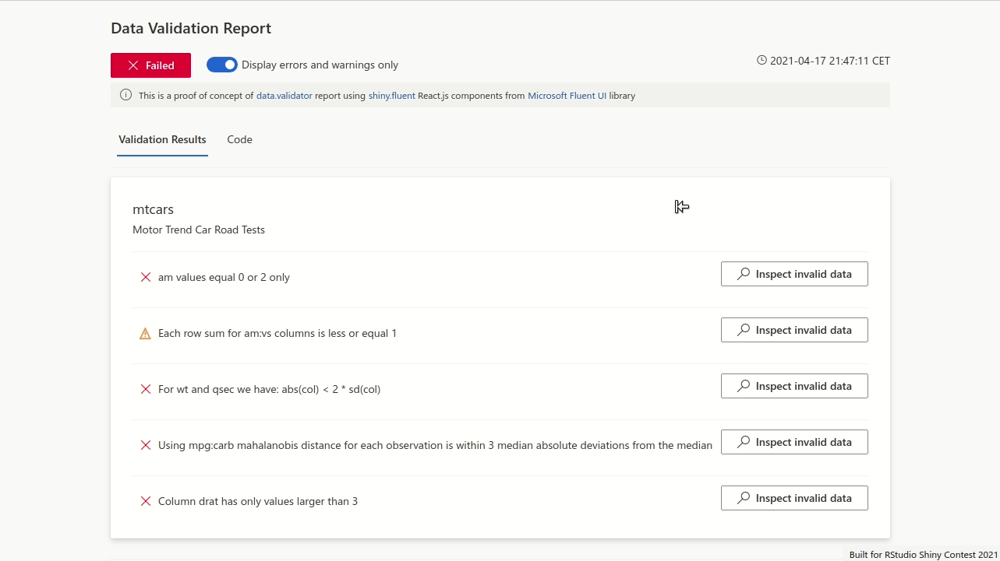
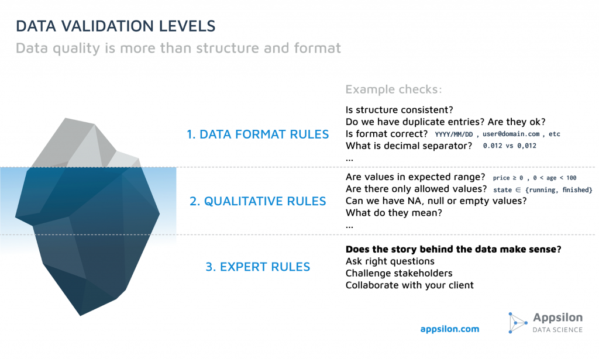

# Data.Validator Report

This repo contains Shiny app code which is a proof of concept for a data validation report
generated from the [data.validator](https://github.com/Appsilon/data.validator) package.
It is also a test run of our [shiny.fluent](https://github.com/Appsilon/shiny.fluent) package,
which allows for building Shiny apps with React.js components without the need for JS programming.

You can view the application here: https://pawelp.shinyapps.io/data-validator-report/

## Story behind the app

In our projects, we perform rigorous data validation before we use data, especially when the data
is updated periodically or can be uploaded by the user. Data almost always contains some errors,
no matter the source. Most of these errors are related to the format, but often there are also
quantitative requirements. But that's not all - additionally, there are very important expert
rules which are often project specific. You can read about these rules in our
[blogpost about data quality](https://appsilon.com/data-quality/) and how we saved
significant money for our clients by adhering to them.

An important part of our validation is close collaboration with the client and project stakeholders.
There are often situations where the validation rule depends on expert knowledge or a specific
business decision. To make this collaboration efficient, we present validation results as a report
and share them with the client. Thanks to the report, it is easier to inspect corrupted data and
discuss potential root causes and solutions.

I used [shiny.fluent](https://github.com/Appsilon/shiny.fluent) package to build a proof of concept that:

* proves how easy it can be to use React.js components within Shiny
* has a professional-looking UI thanks to
  [Microsoft Fluent UI](https://developer.microsoft.com/en-us/fluentui) components

**Note:** this POC app is a hypothetical report generated after running
[data_validation.R](./data_validation.R) code.

## About data.validator

Data.validator is similar to *testthat*, but designed for data validation. It is built on top
of the awesome [assertr](https://github.com/ropensci/assertr) package, with a simplified API
for generating reports. The most common use case is to combine data.validator code with data
processing scripts used in ETLs / pipelines / batch jobs.

See [the repo](https://github.com/Appsilon/data.validator) for more examples.

**Note:** Current version which is released on CRAN (0.1.5) generates rmarkdown HTML report
using shiny.semantic. This POC shiny.fluent app is not integrated yet.

## About shiny.fluent

At first glance it might seem like any other package with regular HTML components themed with
CSS and JS. The difference is that shiny.fluent uses React.js components, which is a different
approach. As a first library with React.js components ported to Shiny we drew on
[Microsoft Fluent UI](https://developer.microsoft.com/en-us/fluentui).

See [the repo](https://github.com/Appsilon/shiny.fluent) for example apps built with shiny.fluent.
